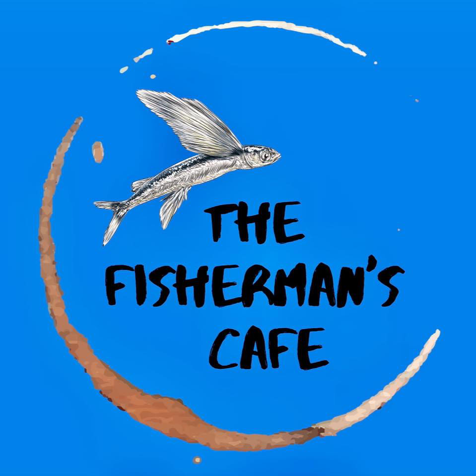

# The Fisherman's Cafe

A web app aimed at introducing the brand, the products, and the services of a local cafe [*The Fisherman's Cafe*](https://thefishermanscafe.info).

The design centered was purposely centered around content managing capabilities and customizations for client ease-of-use and maintainability.

This is the project my group pursued in our Software Engineering class using the tech stack: 
- Django 
- React
- PostgreSQL

It is utilizing Azure Cloud Services for deployment such as App Service, Static Web App, Database for PostgreSQL, and Blob Storage.

When visiting the site for the first time, expect unloaded components due to free tier hosting limitations where servers are put down to sleep after minutes of inactivity. You might want to wait for a couple of seconds to a minute for the backend server to start and deliver resources.

